**AASMA - Final report - Group 46**

# Planet exploration

[João Silva](mailto:joao.afonso.silva@tecnico.ulisboa.pt), [Rafael Henriques](mailto:rafael.henriques@tecnico.ulisboa.pt), [Vasco Faria](mailto:vasco.faria@tecnico.ulisboa.pt) - Instituto Superior Técnico, Lisbon, Portugal

**ABSTRACT**

In this project we implemented an application that shows the behavior of a multi-agent system where a group of intelligent rovers of two types search and collect different kinds of resources spread throughout the surface of an unknown planet. One type of rover focuses on searching while the other on collecting. The main problem lies in collecting the resources as efficiently and as quickly as possible. We solved the problem using both reactive and hybrid architectures. The whole project was implemented using the Unity framework.

1 **Introduction** 

An imaginary space team found a **new planet with many new resources to discover**. This team decided to set up a base camp on this planet and send **intelligent rovers to explore and gather the resources** (the places of the resources is not known in advance). The base camp has an arbitrary number of **rovers of two kinds, scouts** (small and very quick rovers that scout the planet and find resources) and **collectors** (large and slow rovers that collect resources). There are also **multiple kinds of resources, small, medium and large**. A collector can only carry a certain amount of resources, depending on its kind, so the main problem that arises is how can we speed up the process of collecting resources. The agents have to **negotiate**, to decide which resources are collected by who and **cooperate** when carrying a large resource that requires two agents to be transported.

The main objective of the project is to develop a multi-agent system where agents have to cooperate to collect all the planet samples as fast as possible.

2 **Environment**

The environment is an unexplored planet with resources scattered throughout the surface. Visually, the planet is a 3D Sphere Mesh that has resources spread throughout the surface as seen in figure 1.

   
  Figure 1 - unexplored planet

We decided to use an actual sphere instead of a plane, for example, as it brings complexity to the problem and makes the end result a lot more interesting to watch.

2.1 **Properties**

The environment is **inaccessible** since the rovers only have information about the part of the environment they saw, and that information isn’t always accurate. The environment is **non-deterministic** because the rovers, while moving, have a low chance of breaking down. The environment is **dynamic** because the rovers are deliberating while rovers are changing the environment by moving resources. The environment is **discrete** because the rovers have a finite number of actuators and sensors (described later in this section). And the environment is **non-episodic** because it cannot be separated into independant intervals, the resources collected will always have an influence on the future of the scenario.

The resources can be divided into three kinds:

- Small resources (figure 2)
  - Collector rovers can carry up to three

   
  Figure 2 - small resource 

- Medium resources (figure 3) 
  - Collector rovers can only carry one at a time 

   
  Figure 3 - medium resource

- Large resources (figure 4)
  - Needs two collector rovers to be carried

   
  Figure 4 - large resource

This environment is highly configurable, it is possible to specify the radius of the planet and the number of each kind of resource. The resources are randomly spread throughout the surface.

2.2 **Implementation**

The main implementation challenge lay in **placing the resources randomly throughout the surface and ensuring that they were spawned an arbitrary radius away from the main base.**

To spawn resources randomly throughout the surface, for each resource we define an ignore vector, I, and an ignore radius, a, both represented in figure 5. We calculate a random unit vector, R and then the angle B between R and I. While this angle is below a we generate another unit vector, R, until vector is no longer within the a. The position in the planet’s surface is then calculated as follows: PC + R x PR where PC is the planet's center position and PR the redius of the planet.

   
  Figure 5 - Ignore angle and direction

3 **Agents**

Each agent is a rover that behaves independently but may interact with the others. There are two kinds of rovers, each with its own different sensors and actuators.

3.1 **Scout Rover**

The goal of the scout rover is to quickly travel across the planet and using his sensors find resources and broken rovers. Then it should inform the collectors of the resource’s position or broken rover’s position. To fulfill these necessities we decided to give it the following sensors and actuators:

**Sensors**
- Resource detector with a very large radius
- Antenna, receives messages from other rovers within a large range
- Fuel measurer that detects the state of the fuel tank

**Actuators** 

- Move towards resource / base / rover. This actuator has a low chance of failure where the fuel tank breaks and its current fuel jumps immediately to zero. 
- Send message 

3.2 **Collector Rover**

The collector rover is heavy and slow but its large storage is capable of carrying different kinds of resources. This rover can also help any broken rover by carrying a full fuel tank to them. These are their sensors and actuators:

**Sensors**
- Antenna, receives messages from other rovers within a large range
- Fuel measurer detects amount of fuel on agent

**Actuators** 

- Move towards resource / base / rover. This actuator has a low chance of failure where the fuel tank breaks and its current fuel jumps immediately to zero. 
- Send message
- Grab / Drop resource
- Grab / Deliver gasoline

3.3 **Implementation**

Most of the actuators were simple to implement, with the exception of movement actuators since they act on a spherical surface. For these reasons we will only enter in detail for the movement actuators.

From the start we decided to use the **AI movement algorithms for games** and adapt them to work on a spherical surface since they are very robust and customizable. In particular we implemented a subset of the **steering behaviors**: Arrive[1], Look Where You’re Going[2] and Wander[3].

**Arrive** allows the rovers to move towards a target point and slow down when arriving at the point. To make this algorithm work on a spherical surface we have to alter the target to arrive at, because it can no longer be a point in 3D space, otherwise if this point was on the other side of the planet then the rover would go through the surface of the planet.

The solution is to create a target close to the rover’s position and within the plane tangent to the rover’s position on the planet. First we calculate a vector from the center of the planet to the actual target position, CT, then we calculate another vector from the center of the planet to the position of the rover, CR. Then we calculate the cross product between the CT and CR, O. Finally the cross product between CR and O creates a vector that points to the target's position, but tangent to the planet’s surface marked as green in figure 6. Outlined in red is the target point. The aforementioned vectors are all represented in figure 6.

   
  Figure 6 - Vectors from arrive on a spherical surface

**Look Where You’re Going** ensures that the rovers face the direction of movement without making the rotations too abrupt, everything is done with angular accelerations which makes turns really smooth and natural.

**Wander** is used by the Scout Rovers to move randomly throughout the planet, each frame the algorithm calculates a new linear acceleration that is integrated in the scout movement to make it change direction. This linear acceleration is calculated in a way that the rover does not change direction too quickly which would happen if its movement direction was calculated from a random direction.

**Both** these two algorithms did not need any adaptations to work on a spherical surface.

4 **Architectures / Decision Making**

4.1 **Reactive agents:**

In this version of the project we decided to use reactive agents for both rovers with a **subsumption architecture**. The rovers that can communicate between themselves. The scouts **wander** around the planet **until they find a resource/ broken rover (points of interest aka POI)** and then they will **go back to base while broadcasting** the location. The collectors will **wait in base** for a task from the scout, when they receive one they go to the point of interest’s location, **accomplish the task and go back to base waiting for further tasks.**

**Scout Rovers:**

The scout’s internal state is composed by the following parameters:
- The base’s location.
- Its location.
- A parameter that records if it has found a POI and has its location as well as the kind of point.

Most of the actuators were simple to implement, with the

exception of movement actuators since they act on a

spherical surface. For these reasons we will only enter in **Look Where You’re Going** ensures that the rovers face the detail for the movement actuators. direction of movement without making the rotations too

abrupt, everything is done with angular accelerations which From the start we decided to use the **AI movement** makes turns really smooth and natural.

**algorithms for games** and adapt them to work on a

spherical surface since they are very robust and **Wander** is used by the Scout Rovers to move randomly customizable. In particular we implemented a subset of the throughout the planet, each frame the algorithm calculates a **steering behaviors**: Arrive[1], Look Where You’re Going[2] new linear acceleration that is integrated in the scout and Wander[3]. movement to make it change direction. This linear

acceleration is calculated in a way that the rover does not **Arrive** allows the rovers to move towards a target point and change direction too quickly which would happen if its

slow down when arriving at the point. To make this movement direction was calculated from a random algorithm work on a spherical surface we have to alter the direction.

target to arrive at, because it can no longer be a point in 3D

space, otherwise if this point was on the other side of the Both these two algorithms did not need any adaptations to planet then the rover would go through the surface of the work on a spherical surface.

planet.

The solution is to create a target close to the rover’s 4 **Architectures / Decision Making**

position and within the plane tangent to the rover’s position

on the planet. First we calculate a vector from the center of

the planet to the actual target position,, then we 4.1 **Reactive agents**:

calculate another vector from the center of the planet to the

position of the rover, . Then we calculate the cross In this version of the project we decided to use reactive

agents for both rovers with a **subsumption architecture. **product between the and , . Finally the cross

The rovers that can communicate between themselves. The product between and creates a vector that points to scouts **wander** around the planet **until they find a**

the target’s position, but tangent to the planet’s surface **resource/ broken rover (points of interest aka POI)** and marked as green in figure 6. Outlined in red is the target then they will **go back to base while broadcasting** the point. The aforementioned vectors are all represented in location. The collectors will **wait in base** for a task from the figure 6. scout, when they receive one they go to the point of

interest’s location, **accomplish the task and go back to**

**base waiting for further tasks**.

**Scout Rovers: Collector Rovers:**

The scout’s internal state is composed by the following The collector’s internal state is composed by the following parameters: parameters:

- The base’s location. ● The base’s location.
- Its location. ● Its location.
- A parameter that records if it has found a POI and ● A target parameter that records the current POI has its location as well as the kind of point. and relevant information.

The first two parameters are saved so that the scout can go The first two parameters are saved so that the scout can go to base, while the last parameter is used so that it can to base, while the last parameter is used so that it can **broadcast the relevant information** for the collector’s accomplish the current task.

task. The scouts will broadcast this message **until a**

**collector responds to the message** saying that they will The Collector’s decision making is structured in the go there.Then the scout will respond with the location and following way:

stop broadcasting.

IF Near(BASE):

The scout’s decision making is structured in the following RefillFuel() way:

IF CheckFuel() == EMPTY:

IF Near(BASE): Broadcast(I\_AM\_BROKEN)

RefillFuel() RETURN

IF CheckFuel() == EMPTY: ELSE IF CheckFuel() == LOW:

Broadcast(I\_AM\_BROKEN) Go to base

RETURN

ELSE IF isHoldingResource() && Near(BASE): ELSE IF CheckFuel() == LOW: DROP resource

Go to base

ELSE IF isHoldingResource() && not Near(BASE): IF ReceivedMessage() GO to base

SWITCH (Received Message):

AVAILABLE\_TO\_COLLECT\_RESOURCE: ELSE IF hasTargetResource() && Near(TARGET):

SEND POI location to rover GRAB resource

RESET POI location

ELSE IF carryingGas && Near(TARGET): AVAILABLE\_TO\_HELP\_ROVER: HELP broken rover

SEND POI location to rover

RESET POI location ELSE IF TARGET = BrokenRover && not carryingGas:

IF Near(BASE) get gas ELSE GO to base

I \_AM\_BROKEN:

SAVE broken rover location as POI ELSE IF not Near(TARGET):

GO to target location

IF DetectedResource() AND no current POI:

SAVE resource as POI SWITCH (Received Message): GO\_TO\_RESOURCE:

BROADCAST(POI) SET new TARGET

IF current POI GO\_TO\_ROVER:

GO to base SET new TARGET

ELSE FOUND\_RESOURCE:

MOVE randomly REPLY AVAILABLE\_TO\_COLLECT

FOUND\_BROKEN\_ROVER:

REPLY  AVAI LABLE\_TO\_HELP

4.2 **Reactive Scout and Hybrid Collector: Hybrid utility-based collectors**:

In this version, both scouts and collectors have an internal Although we will call these agents Hybrid they only have a state that **saves all known POIs found throughout the** small **reactive** component that takes **precedence** over the **run** as well as relevant information about them. The **deliberative** component, this reactive part makes the agent relevant information includes: deal with **Fuel** related problems (empty, low, refill). This part

- Location of POI is reactive since the rover **can't predict** if his fuel tank
- Type of POI breaks down. But for the rest of his actions the collector has
- If a collector is assigned to the POI a **single-minded commitment** to his plan and so they only change their current action when they finish the action or

This information will be used as a **map** for the rovers. realize that it’s impossible to finish.

**Revised Reactive Scouts:** The Collector’s decision making is structured in the

following way:

In this second version of the agents we initially planned on

making the Scout a deliberative agent, however after giving IF Near(BASE):

this idea more thought we concluded that they would always RefillFuel()

have the same plan, which is travelling randomly across the

planet’s surface and so naturally **generating a new plan** IF CheckFuel() == EMPTY: **each frame would be unnecessary.** Broadcast(I\_AM\_BROKEN)

RETURN

For these reasons the new reactive scouts will have the

same decision making but the **communication framework** ELSE IF CheckFuel() == LOW:

**is changed**. Now, instead of having specific messages for Go to base

specific situations the scout is limited to **exchanging** his

version of the map with all surrounding rovers every 3 IF PLAN\_DONE:

seconds.This time was chosen taking into account the fact plan = GereratePlan()

that this exchange has a complexity of #Rovers\*MapSize^2,

although the maps are never very big, since this is a IF (CURRENT\_ACTION\_DONE): simulation and the computer has to calculate this for all POP new action from the plan rovers, it ends up being a CPU intensive task if done each

frame so we tried not to use it often. IF not CURRENT\_ACTION\_DONE:

EXECUTE action

This map will then be updated taking into account all other

versions received in the exchange. If a **new point** is ELSE

received this point will be added to his map, and if an PLAN\_DONE = true

**already known unassigned** point is **assigned** then this

point is updated on the map. The only other message still We decided to incorporate a **utility function** because there broadcasted is the message that asks for help in case the are certain situations where the agents face multiple options rover is out of gas. and with a utility function they can decide what is the best plan in that particular situation. We don’t calculate it

The new scout’s decision making is structured in the **explicitly**, but instead use **priority of plan choosing** using following way: the order of the list below, and choosing a random POI if they have the same priority, except for the large resource

IF Near(BASE): that they choose the closest ones in order to reduce the RefillFuel() waiting time of the other rover. Each set of POIs have the

following utilities:

IF CheckFuel() == EMPTY:

Broadcast(I\_AM\_BROKEN) ● Help a broken Rover: 20

RETURN ● Help to carry/Carry a large resource: 15

- Get 3 small resources: 12 (3 \* 4)

ELSE IF CheckFuel() == LOW: ● Get a medium resource: 10

Go to base ● Get N small resources: N \* 4, N ∊ [1, 2]

IF ReceivedMessage() We decided to assign a **higher utility** to the plans that have

SWITCH (Received Message): **waiting rovers** like a broken one or a rover that is waiting

I \_AM\_BROKEN:

for help to carry a large resource in order to have the **most** SAVE broken rover location as POI

**operational rovers** we can have. The next worthwhile plan

is to get 3 small resources at once because we can save 2 IF DetecStAeVdER erseosuorucrec(e)  aAsN DP OnIo current POI: trips to base followed by the medium resource in order to

give scouts some **time to find more small resources and** MOVE randomly **then grab three at once.**

The plan is a Stack of a set of the following Actions: 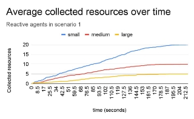

{ GO\_TO\_ROVER, GO\_TO\_BASE, GO\_TO\_RESOURCE, GRAB\_GAS, GRAB\_SMALL\_RESOURCE, HELP\_ROVER, GO\_TO\_SMALL\_RESOURCE, GRAB\_RESOURCE, DROP\_RESOURCE, GRAB\_LARGE\_RESOURCE, WAIT\_FOR\_ROVER } 

The GeneratePlan() function consists of analysing the **internal map belief** and trying to find the **max utility** they can get from it, then in order to generate the plan they push the necessary actions in order to create a consistent plan. 

5 **Comparative Analysis** 

Figure 7 - Collected resources over time in S1

We defined a scenario as a set of parameters: the number 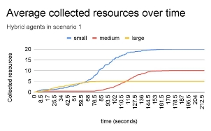of scouts, collectors; the radius of the planet; the number of each kind of resource. We created **3 different scenarios** (S1, S2, S3) that we will be using for comparison: 

**S1 - Few rovers and resources** 

- 20 small resources 
- 10 medium resources 
- 5 large resources 
- 4 scout rovers 
- 3 collector rovers 
- Planet radius of 60 units 

**S2 - Some rovers and resources** 

- 40 small resources Figure 8 - Collected resources over time in S1
- 20 medium resources
- 10 large resources analysisIt is importantfor bothto mentionscenariothat2 andwe3,performedhowever thistheyprevioushad the
- 8 scout rovers exact same results so we did not place the respective
- 6 collector rovers graphs in the report.
- Planet radius of 110 units

We also compared the average collector's useless trips and **S3 - Many rovers and resources** trips to base. The results show that with reactive agents the

- 80 small resources collectors gradually do more useless trips but perform too
- 40 medium resources many unnecessary trips since they grab one small resource
- 20 large resources at a time. The collectors with a hybrid architecture on the
- 12 scout rovers other hand do many less trips to base than the reactive
- 8 collector rovers ones. However, sometimes their beliefs do not show the
- Planet radius of 200 units most up to date map information and also due to their single-minded commitment they perform a lot more useless

For each scenario we performed a **total of 20 runs**, the trips.

graphs in the next pages are all calculated as an average

from these 20 runs. 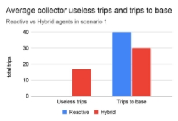

We started by comparing the collected resources over time. To calculate this graph we ran the application 20 times and for each timestamp (0s, 0.5s, 1.0s etc…) we calculated the average number of collected resources. From figures 7,8 it’s easy to understand that the reactive rovers grab resources gradually and at a constant pace while on the hybrid architecture there are moments where the rovers collect resources really fast. This is especially noticeable with the small resources because with the hybrid architectures the collectors create a plan to grab multiple

small resources. Figure 9 - Useless Trips in S1

Figure 10 -  Useless Trips in S2 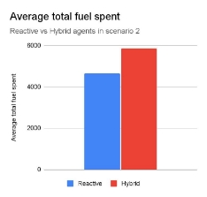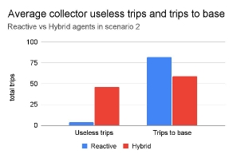

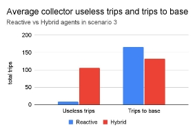 Figure 13 - Total fuel spent in S2

Figure 11 -  Useless Trips in S3 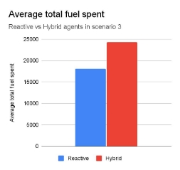

Regarding the total fuel spent, surprisingly the average total fuel spend is actually not that much different. We were expecting to have a lot more expended fuel in the hybrid

Figure 14 - Total fuel spent in S3

architecture due to the scouts essentially never stopping

because they are constantly travelling across the planet. It’s

Finally we compared the average elapsed time that the also noticeable that as the scenario becomes more complex

the difference between the total fuel spent between the rovers take to collect all resources. In all three scenarios the types of agents becomes increasingly higher. hybrid agents outperformed the reactive agents. The most interesting result is that it seems that the larger the planet,

the more rovers and the more resources we add to the scenario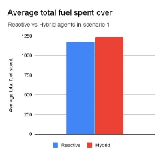 the more the hybrid agents outperform the reactive agents. This occurs because of the proactiveness that emerges from the hybrid architecture where the collectors now continue to gather resources one after another while their map belief has available resources, contrary to what happened in the reactive architecture where the collectors would be constantly waiting to react to the resource’s position that the scout rovers would bring. Also the hybrid architecture diminishes the time wasted by useless trips since the collector is able to come up with a new plan on the spot instead of going back to base, this ends up compensating for the fact that the hybrid architecture has

more useless trips.

Figure 12 -  Total fuel spent in S1

6 **Conclusions and Further Work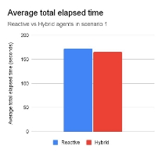**

From the comparative analysis we understood that the hybrid architecture led the rovers to collect the resources faster which ultimately was our main goal. However, it led them to do a lot more useless trips and waste a lot of fuel, which in a real world scenario would be a big problem. The Hybrid architecture also showed better performance as the scenario scales but it was more CPU intensive. Regardless, both types of agents were successfully able to solve the problem in a short amount of time.

We also believe that the hybrid architecture still has some Figure 15 - Total elapsed time in S1 space for improvements that we could not accomplish due

to our time constraints.

The most significant one is that, unlike our project proposal, the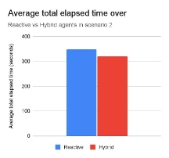 hybrid agents don’t have open-minded commitment. This would make more sense since one of the biggest time wasters for hybrid rovers is that sometimes more than one collector goes to the same POI. If we had time to implement open-mindedness the rovers would realise through their map that a rover is already assigned,and through a comparison of utility values they could decide which one would go and which one would come up with a new plan.

Another possible minor improvement on the hybrid decision making would be to make collectors that made a useless trip decide the next plan taking proximity into account. Figure 16 - Total elapsed time in S2 Although this approach based on proximity would give worse results when done all the time because most scouts

would go to the same POI, when done only after a useless trip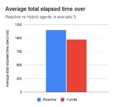 (when the scouts usually are far away from the others) it

would probably save time.

**REFERENCES**

1. Millington, Ian. “Arrive.” *AI for Games*, 2nd ed., p. 62.
1. Millington, Ian. “Looking Where You’re Going.” *AI for Games*, 2nd ed., p. 75.
1. Millington, Ian. “Wander.” *AI for games*, 2n ed., p. 76.

Figure 17 - Total elapsed time in S3
